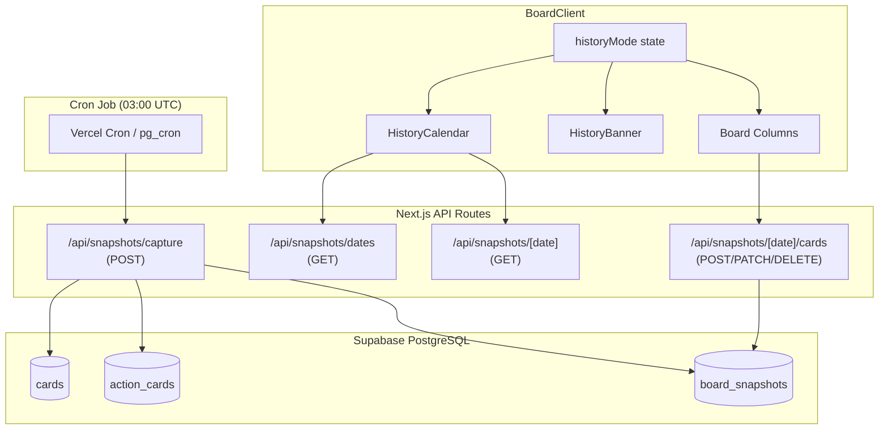

# Design: Board History

## Overview

O sistema de histórico do Retro Board captura automaticamente snapshots diários do estado do board à meia-noite no horário de Brasília (America/Sao_Paulo), armazenando-os como JSONB no Supabase PostgreSQL. Os usuários navegam pelo histórico via um calendário (react-day-picker) integrado ao sidebar, podendo visualizar e editar snapshots de dias anteriores sem interferir no board ativo.

A arquitetura é baseada em:

- **Cron job** (03:00 UTC = 00:00 BRT) que chama uma API route para capturar snapshots
- **API routes** para consultar datas disponíveis, carregar snapshots e editar cards históricos
- **Estado local** no `BoardClient` para gerenciar o modo histórico sem afetar outros participantes
- **Canais de broadcast separados** para isolar atualizações de snapshots do board ativo

## Architecture



## Components and Interfaces

### 1. Tabela `board_snapshots`

```sql
CREATE TABLE board_snapshots (
    id UUID PRIMARY KEY DEFAULT gen_random_uuid(),
    session_token TEXT NOT NULL REFERENCES sessions(token) ON DELETE CASCADE,
    reference_date DATE NOT NULL,
    snapshot_data JSONB NOT NULL,
    created_at TIMESTAMPTZ NOT NULL DEFAULT now(),
    UNIQUE(session_token, reference_date)
);

CREATE INDEX idx_board_snapshots_session_date
    ON board_snapshots(session_token, reference_date DESC);
```

### 2. API Route: `POST /api/snapshots/capture`

Chamada pelo cron job. Itera todas as sessões, verifica se há cards, e cria snapshots.

```typescript
// app/api/snapshots/capture/route.ts
interface CaptureRequest {
  authorization?: string; // Token secreto para proteger o endpoint
}

interface CaptureResponse {
  captured: number;
  skipped: number;
  errors: string[];
}
```

**Lógica:**

1. Validar token de autorização (variável de ambiente `CRON_SECRET`)
2. Calcular `reference_date` = dia anterior no horário de Brasília
3. Buscar todas as sessões
4. Para cada sessão: buscar cards + action_cards
5. Se houver pelo menos 1 card: inserir snapshot com `ON CONFLICT DO NOTHING`
6. Timeout global de 120s via `AbortController`

### 3. API Route: `GET /api/snapshots/dates`

Retorna lista de datas com snapshots disponíveis para uma sessão.

```typescript
// app/api/snapshots/dates/route.ts
interface DatesRequest {
  session_token: string; // query param
}

interface DatesResponse {
  dates: string[]; // formato "YYYY-MM-DD"
}
```

### 4. API Route: `GET /api/snapshots/[date]`

Retorna os dados do snapshot de um dia específico.

```typescript
// app/api/snapshots/[date]/route.ts
interface SnapshotRequest {
  session_token: string; // query param
  // date vem do path param
}

interface SnapshotResponse {
  snapshot: {
    id: string;
    reference_date: string;
    snapshot_data: SnapshotData;
    created_at: string;
  };
}
```

### 5. API Route: `POST/PATCH/DELETE /api/snapshots/[date]/cards`

Edita cards dentro de um snapshot específico.

```typescript
// app/api/snapshots/[date]/cards/route.ts
interface SnapshotCardCreate {
  column_type: "good" | "bad" | "ideas";
  text: string;
  author: string;
  author_id: string;
}

interface SnapshotCardUpdate {
  id: string;
  text?: string;
  column_type?: "good" | "bad" | "ideas";
}

interface SnapshotCardDelete {
  id: string;
}

// Para action cards no snapshot:
interface SnapshotActionCreate {
  text: string;
  responsible?: string | null;
  author: string;
  author_id: string;
}
```

**Lógica de edição:**

1. Buscar o snapshot pela sessão + date
2. Fazer parse do `snapshot_data` JSONB
3. Aplicar a operação (add/update/delete) no array de cards/actions
4. Validar limites (500 chars, 100 cards por coluna, texto não-vazio)
5. Atualizar o campo `snapshot_data` no banco
6. Broadcast da alteração no canal `retro-history:{token}:{date}`

### 6. Componente `HistoryCalendar`

Integrado ao sidebar direito do board, abaixo do timer e participantes.

```typescript
// components/board/history-calendar.tsx
interface HistoryCalendarProps {
  sessionToken: string;
  onSelectDate: (date: Date) => void;
  onExitHistory: () => void;
  isHistoryMode: boolean;
  selectedDate: Date | null;
}
```

**Implementação:**

- Usa `react-day-picker` (DayPicker) com `mode="single"`
- Usa `date-fns` para manipulação de datas
- Busca datas disponíveis via `/api/snapshots/dates` no mount
- Dias com snapshot recebem `modifiers={{ hasSnapshot: snapshotDates }}`
- Dias sem snapshot: `disabled` via prop `disabled`
- Navegação limitada ao mês corrente (sem futuro) via `toMonth`
- Botão "Voltar ao board atual" visível quando `isHistoryMode === true`

### 7. Componente `HistoryBanner`

Banner fixo (sticky) exibido no topo da área do board durante o modo histórico.

```typescript
// components/board/history-banner.tsx
interface HistoryBannerProps {
  date: Date;
  onExit: () => void;
}
```

**Comportamento:**

- Posição `sticky top-0 z-50` para permanecer visível durante scroll
- Exibe: "📅 Visualizando snapshot de {dd/mm/aaaa} — Alterações serão salvas neste dia histórico"
- Botão "Voltar ao board atual"
- Não-dispensável (sem botão de fechar)
- Fundo com cor de destaque (amber/yellow) para alta visibilidade

### 8. Gerenciamento de Estado no `BoardClient`

```typescript
// Novos estados no BoardClient
const [historyMode, setHistoryMode] = useState(false);
const [historyDate, setHistoryDate] = useState<Date | null>(null);
const [historyCards, setHistoryCards] = useState<Card[]>([]);
const [historyActionCards, setHistoryActionCards] = useState<ActionCard[]>([]);
const [historySnapshotId, setHistorySnapshotId] = useState<string | null>(null);
```

**Fluxo:**

1. Usuário seleciona data no calendário → `setHistoryMode(true)`, `setHistoryDate(date)`
2. Fetch do snapshot via `/api/snapshots/[date]`
3. Popula `historyCards` e `historyActionCards` com dados do snapshot
4. Board renderiza `historyCards` em vez de `cards` do realtime
5. Eventos de realtime continuam chegando mas não afetam a visualização
6. Edições no modo histórico vão para `/api/snapshots/[date]/cards`
7. "Voltar ao board" → `setHistoryMode(false)`, limpa estado de histórico

### 9. Broadcast Isolado para Modo Histórico

Canal separado: `retro-history:{token}:{date}`

- Quando um participante entra no modo histórico de um dia, se inscreve neste canal
- Edições no snapshot são propagadas neste canal
- O canal principal `retro:{token}` não é afetado
- Ao sair do modo histórico, o participante cancela a inscrição no canal de histórico

## Data Models

### SnapshotData (JSONB)

```typescript
interface SnapshotData {
  cards: SnapshotCard[];
  actionCards: SnapshotActionCard[];
}

interface SnapshotCard {
  id: string;
  column_type: "good" | "bad" | "ideas";
  text: string;
  author: string;
  author_id: string;
  votes: number;
  voters: string[];
  created_at: string;
}

interface SnapshotActionCard {
  id: string;
  text: string;
  responsible: string | null;
  author: string;
  author_id: string;
  created_at: string;
}
```

### Tipo Database Atualizado

```typescript
// Adição em lib/types/database.ts
board_snapshots: {
  Row: {
    id: string;
    session_token: string;
    reference_date: string; // formato "YYYY-MM-DD"
    snapshot_data: SnapshotData;
    created_at: string;
  };
  Insert: {
    id?: string;
    session_token: string;
    reference_date: string;
    snapshot_data: SnapshotData;
    created_at?: string;
  };
  Update: {
    id?: string;
    session_token?: string;
    reference_date?: string;
    snapshot_data?: SnapshotData;
    created_at?: string;
  };
};
```

### Configuração do Cron (vercel.json)

```json
{
  "crons": [
    {
      "path": "/api/snapshots/capture",
      "schedule": "0 3 * * *"
    }
  ]
}
```

## Correctness Properties

_Uma propriedade é uma característica ou comportamento que deve ser verdadeiro em todas as execuções válidas de um sistema — essencialmente, uma declaração formal sobre o que o sistema deve fazer. Propriedades servem como ponte entre especificações legíveis por humanos e garantias de corretude verificáveis por máquina._

### Property 1: Completude da captura

_Para qualquer_ sessão com pelo menos um card em qualquer coluna, o snapshot capturado SHALL conter exatamente todos os cards e action_cards da sessão com todos os campos preservados (id, text, votes, voters, column_type, author, author_id, responsible, created_at).

**Validates: Requirements 1.1**

### Property 2: Sessões vazias não geram snapshot

_Para qualquer_ sessão onde a soma de cards em todas as colunas (Bom, Ruim, Ideias) e action_cards é zero, a função de captura SHALL não criar nenhum registro de snapshot para aquela sessão naquela data.

**Validates: Requirements 1.2**

### Property 3: Idempotência da captura

_Para qualquer_ sessão e data de referência, executar a função de captura N vezes (N ≥ 1) SHALL resultar em exatamente um registro de snapshot no banco de dados para aquela combinação sessão+data.

**Validates: Requirements 1.3**

### Property 4: Cálculo da data de referência

_Para qualquer_ timestamp UTC utilizado como momento de captura, a data de referência calculada SHALL ser o dia calendário que está se encerrando no fuso America/Sao_Paulo (ou seja, se a captura ocorre às 03:00 UTC do dia 15, e isso corresponde a 00:00 BRT do dia 15, a data de referência é dia 14).

**Validates: Requirements 5.1, 5.3**

### Property 5: Formatação de datas em Brasília

_Para qualquer_ data de referência armazenada no formato ISO (YYYY-MM-DD), a função de formatação para exibição SHALL produzir uma string no formato DD/MM/AAAA correspondente à mesma data no fuso America/Sao_Paulo, independentemente do timezone do ambiente de execução.

**Validates: Requirements 2.4, 3.2, 5.2, 5.5**

### Property 6: Dias selecionáveis correspondem a snapshots existentes

_Para qualquer_ mês exibido no calendário e qualquer conjunto de datas com snapshots para a sessão, o conjunto de dias habilitados para seleção SHALL ser exatamente igual ao conjunto de datas com snapshots naquele mês — sem dias extras habilitados e sem dias com snapshot desabilitados.

**Validates: Requirements 2.1, 3.3**

### Property 7: Ordenação dos cards no snapshot

_Para qualquer_ snapshot carregado para visualização, os cards em cada coluna SHALL estar ordenados por votos decrescente e, em caso de empate, por created_at decrescente.

**Validates: Requirements 3.1**

### Property 8: Isolamento bidirecional de dados

_Para qualquer_ mutação realizada no board ativo (adicionar, editar, deletar, votar), o conteúdo de todos os snapshots existentes SHALL permanecer inalterado; e _para qualquer_ mutação realizada em um snapshot histórico, o estado do board ativo e de todos os outros snapshots SHALL permanecer inalterado.

**Validates: Requirements 1.4, 4.2, 6.1**

### Property 9: Eventos realtime ignorados no modo histórico

_Para qualquer_ estado de snapshot sendo exibido no modo histórico e qualquer evento de realtime recebido do canal do board ativo, os cards exibidos ao usuário em modo histórico SHALL permanecer idênticos ao snapshot carregado.

**Validates: Requirements 3.5**

### Property 10: Broadcast isolado — histórico não afeta board ativo

_Para qualquer_ edição realizada por um participante em modo histórico, nenhum evento SHALL ser propagado no canal de broadcast do board ativo (`retro:{token}`), de modo que participantes visualizando o board atual não recebam a alteração.

**Validates: Requirements 6.5**

### Property 11: Validação de edição no modo histórico

_Para qualquer_ operação de edição em um snapshot (adicionar, editar, remover, votar), as mesmas regras de validação do board ativo SHALL ser aplicadas: texto não-vazio, máximo de 500 caracteres por card, máximo de 100 cards por coluna. Operações que violem qualquer regra SHALL ser rejeitadas sem alterar o snapshot.

**Validates: Requirements 4.1**

## Error Handling

| Cenário                                                       | Comportamento                                                                                                                  |
| ------------------------------------------------------------- | ------------------------------------------------------------------------------------------------------------------------------ |
| Falha na captura do cron                                      | Abortar após 120s, registrar erro via `console.error`, não corromper dados existentes. Próxima tentativa na execução seguinte. |
| Token de autorização inválido no `/api/snapshots/capture`     | Retornar 401 Unauthorized                                                                                                      |
| Sessão não encontrada ao buscar snapshot                      | Retornar 404 com mensagem "Snapshot não encontrado"                                                                            |
| Data inválida no path param                                   | Retornar 400 com mensagem "Data inválida"                                                                                      |
| Violação de limites ao editar snapshot (500 chars, 100 cards) | Retornar 400 com código `invalid_payload` e mensagem descritiva                                                                |
| Falha ao persistir edição no snapshot                         | Retornar 500, cliente exibe toast de erro e mantém conteúdo editado no campo                                                   |
| Conflito de concorrência na edição do JSONB                   | Usar `SELECT ... FOR UPDATE` para serializar escritas no mesmo snapshot                                                        |
| Rede indisponível ao carregar calendário                      | Exibir estado de erro com botão "Tentar novamente"                                                                             |
| Snapshot parcial (captura interrompida)                       | Usar transação SQL — se falhar, rollback completo, nenhum dado parcial persiste                                                |

## Testing Strategy

### Testes Unitários (example-based)

- Validação do cálculo de `reference_date` com timestamps em edge cases de DST
- Formatação de datas DD/MM/AAAA para datas conhecidas
- Lógica de ordenação de cards (votos desc, created_at desc)
- Validação de payload das APIs (limites de caracteres, campos obrigatórios)
- Comportamento do componente `HistoryBanner` (visibilidade, conteúdo)
- Navegação do calendário (não permitir meses futuros)
- Estado do `BoardClient` ao entrar/sair do modo histórico

### Testes de Propriedade (property-based)

Biblioteca: **fast-check** (TypeScript)

Cada teste de propriedade deve:

- Executar no mínimo 100 iterações
- Referenciar a propriedade do design via tag de comentário

Formato de tag: `// Feature: board-history, Property {N}: {título}`

| Propriedade               | Estratégia de Geração                                                                           |
| ------------------------- | ----------------------------------------------------------------------------------------------- |
| 1 - Completude da captura | Gerar boards aleatórios com 1-100 cards distribuídos em 4 colunas, verificar snapshot === input |
| 2 - Sessões vazias        | Gerar mix de sessões vazias e não-vazias, verificar que apenas não-vazias geram snapshot        |
| 3 - Idempotência          | Gerar sessão + data, executar captura N vezes (1-10), verificar count === 1                     |
| 4 - Data de referência    | Gerar timestamps UTC aleatórios próximos à meia-noite BRT, verificar reference_date correto     |
| 5 - Formatação            | Gerar datas ISO aleatórias, verificar formato DD/MM/AAAA e equivalência de dia                  |
| 6 - Dias selecionáveis    | Gerar conjuntos aleatórios de datas + mês, verificar habilitados === interseção                 |
| 7 - Ordenação             | Gerar arrays de cards com votos e timestamps aleatórios, verificar sort correto                 |
| 8 - Isolamento            | Gerar board + snapshot, aplicar mutação em um, verificar outro inalterado                       |
| 9 - Realtime ignorado     | Gerar snapshot state + evento aleatório, verificar state inalterado                             |
| 10 - Broadcast isolado    | Gerar edição em modo histórico, verificar que canal ativo não recebe evento                     |
| 11 - Validação            | Gerar operações aleatórias (incluindo inválidas), verificar rejeição/aceitação corretas         |

### Testes de Integração

- Endpoint `/api/snapshots/capture` com banco real (Supabase local via Docker)
- Endpoint `/api/snapshots/dates` retornando datas corretas
- Endpoint `/api/snapshots/[date]` retornando snapshot completo
- Endpoint `/api/snapshots/[date]/cards` persistindo alterações no JSONB
- Fluxo completo: captura → consulta datas → carrega snapshot → edita → verifica persistência
- Comportamento com DST transition dates reais (ex: horário de verão BR)

### Testes E2E (Playwright)

- Fluxo completo do usuário: abrir calendário → selecionar dia → ver cards → editar → voltar ao board ativo
- Verificar banner visível e sticky durante scroll
- Verificar que realtime do board ativo não afeta modo histórico
- Verificar notificação temporária ao editar no modo histórico
